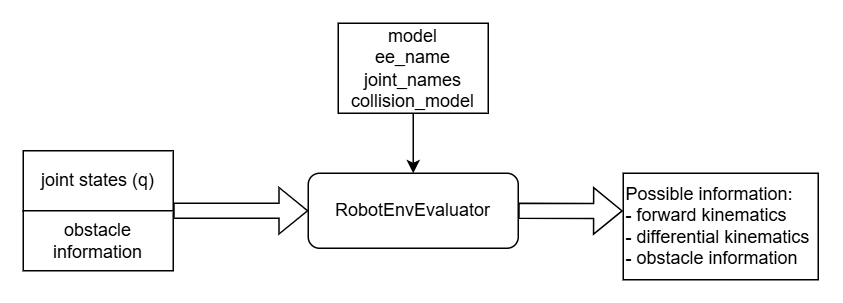

# robot_env_evaluator

The `robot_env_evaluator` module is a C++ library designed to evaluate the geometric and kinematic properties of on robot and its environment. 

It provides functionalities to compute the:
- robot's kinematic properties: kinematics, jacobian.
- robot and environment's geometric information: distance, seperate vector, etc.



## Installation

It is suggested to install this package from the whole example repository [FLIQC_example_workspace_ros](https://github.com/hwyao/FLIQC_example_workspace_ros), which contains all the submodule for this repository.

If you really want to install this package individually:
1. clone this repository.
```bash
git clone https://github.com/riddhiman13/robot_env_evaluator
```
2. Build the library with CMake.
```bash
mkdir build
cd build
cmake ..
cmake --build .
```

## Quick Start

If you only run this as standalone library, you can run the example code.

```bash
robot_env_evaluator_example
```

## Documentation

You can view the online documentation at the link at the right side of this main page. Or you can 
see it here: [robot_env_evaluator API Documentation](https://hwyao.github.io/projects-documentation/robot_env_evaluator/)

The documentation can be generated with Doxygen with the following command after installing Doxygen.
```bash
cd docs
doxygen Doxyfile
```

## Links

We use pinocchio library as our basic library: [pinocchio](https://github.com/stack-of-tasks/pinocchio)

We use coal library as our basic library for collision detection: [coal](https://github.com/coal-library/coal)